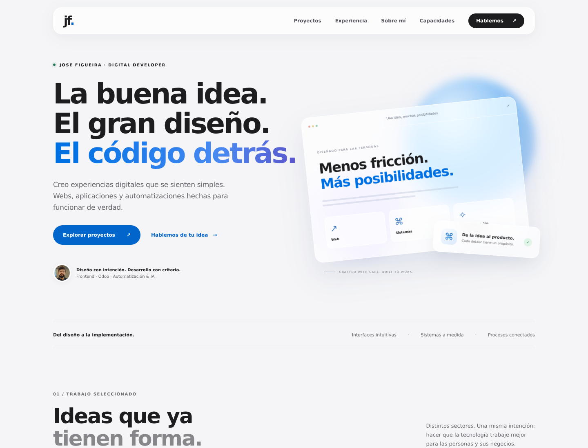
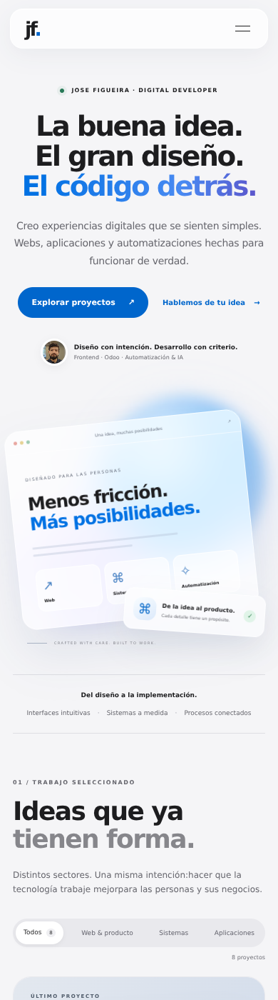

# Jose Figueira — Portfolio

Portfolio estático en español de Jose Figueira. Incluye proyectos, experiencia aplicada, capacidades y contacto, con una estética clara y paneles de cristal.

## Vista local

No requiere instalación de dependencias ni compilación:

```sh
python -m http.server 8765
```

Abrir `http://localhost:8765`. Puede alojarse en cualquier servidor de archivos estáticos.

## Estructura y mantenimiento

- `index.html`: estructura, textos, tarjetas y composiciones visuales.
- `styles.css`: diseño responsive, paneles translúcidos y soporte de movimiento reducido.
- `script.js`: filtros, menú móvil y detalle de proyectos. Los casos se editan en el objeto `projects`.
- `foto.jpeg` y `recursos/yo.jpg`: fotografías originales del portfolio.

Al añadir proyectos, mantener sincronizados la tarjeta HTML, su categoría, el objeto `projects` y el contador inicial del filtro «Todos». Las composiciones visuales son ilustraciones HTML/CSS/SVG, no capturas de interfaces reales. Melkart Náutica no incluye un enlace público porque no se proporcionó una URL.

El contenido de experiencia describe proyectos y especializaciones. No representa una cronología laboral ni incorpora fechas, métricas de impacto o empleadores no documentados.

## Interacciones y accesibilidad

- Filtros por categoría con estado `aria-pressed` y contador anunciado.
- Menú móvil con estado expandido, cierre al navegar, al pulsar Escape y al hacer clic fuera.
- Detalles en un diálogo nativo: cierre con Escape, botón o clic en el fondo y devolución del foco al botón de origen.
- Navegación por teclado, enlace de salto y estilos de foco visibles.
- Respeto de `prefers-reduced-motion` y contenido disponible sin JavaScript.
- Sin fuentes remotas, librerías de interfaz o dependencias de CDN.

## Vistas previas del rediseño

Escritorio:



Móvil:


